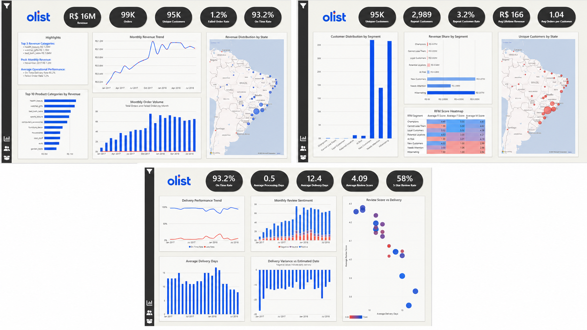
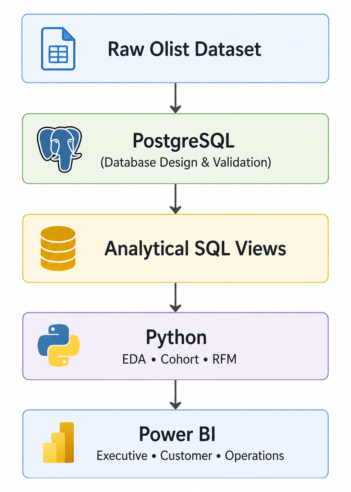
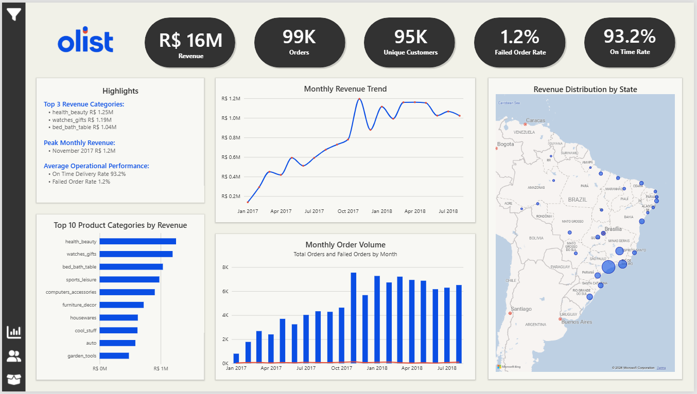
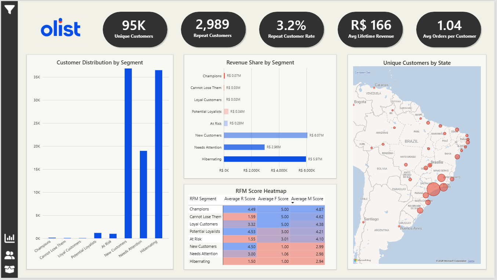
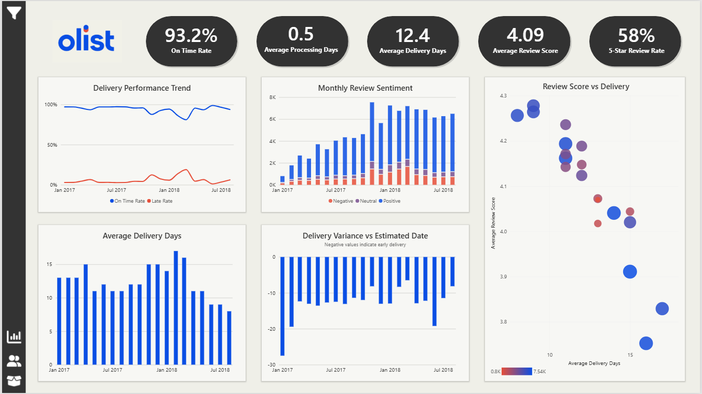
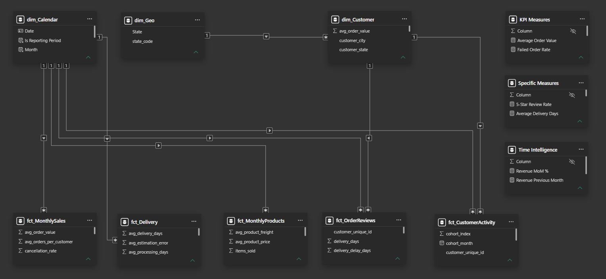
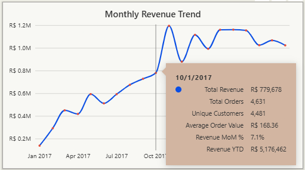

# Olist E-commerce Customer Analytics

End-to-end Business Intelligence project analyzing sales performance, customer behaviour, and delivery operations using PostgreSQL, Python, and Power BI.



---

## Project Overview

This project demonstrates a complete Business Intelligence workflow, transforming raw transactional data into interactive dashboards and business insights.

The solution combines PostgreSQL for database design and analytical views, Python for exploratory data analysis and customer segmentation, and Power BI for interactive reporting.

---

## Project Workflow

The project follows a complete end-to-end Business Intelligence workflow:

1. **SQL** – database design, validation, cleaning and analytical views
2. **Python** – exploratory data analysis, cohort analysis and RFM segmentation
3. **Power BI** – interactive dashboard development using a star schema and DAX measures

<p align="center">

</p>

---

## Tech Stack

| Category              | Technologies                      |
|-----------------------|-----------------------------------|
| Query Editor          | pgAdmin                           |
| Query Language        | PostgreSQL                        |
| Data Analysis         | Python, Pandas                    |
| Visualization         | Matplotlib, Seaborn               |
| Business Intelligence | Power BI                          |
| Data Modeling         | Star Schema                       |
| Analytics             | Cohort Analysis, RFM Segmentation |
| Reporting             | DAX                               |

---

## Dashboard Preview

### Executive Overview



Provides a high-level summary of business performance, including revenue, order volume, customer activity, product performance, and geographical sales distribution.

---

### Customer Insights



Focuses on customer behaviour using RFM segmentation, repeat customer analysis, customer lifetime metrics, and geographical customer distribution.

---

### Operations & Delivery



Analyzes operational efficiency, delivery performance, customer reviews, and the relationship between logistics performance and customer satisfaction.

---

## SQL

The SQL layer is responsible for building a clean, analysis-ready PostgreSQL database. It includes database schema creation, data quality validation, data cleaning, and the development of reusable analytical views used later in Python and Power BI.

### Database Setup

The project begins with creating all database tables based on the original Olist dataset and importing the source CSV files into PostgreSQL.

During the import process, one structural issue was identified: the `order_reviews` table could not use `review_id` as a primary key because the dataset contains duplicate review identifiers. After validation, the constraint was removed since the correct business key is the combination of `review_id` and `order_id`.

Foreign key constraints were intentionally omitted during the initial data load to allow importing raw transactional data and performing integrity validation afterwards.

---

### Data Quality Validation

A comprehensive validation process was performed before starting the analytical stage.

The validation included:

- Row count verification after data import
- Primary and foreign key consistency checks
- Missing value analysis
- Duplicate detection
- Product category translation validation
- Cross-table integrity verification

Several data quality issues were identified during this process, including missing translations, duplicated geolocation records, incomplete delivery information, and inconsistencies in review data.

Instead of removing records automatically, every issue was investigated individually and documented. Records with negligible analytical impact were retained to preserve the integrity of the original dataset, while deterministic issues (such as missing translations and duplicated geolocation records) were corrected.

This approach ensures that all downstream analyses are based on transparent and well-understood data rather than aggressive cleaning.

---

### Analytical SQL Views

Instead of repeatedly querying multiple normalized tables, reusable SQL views were created to provide clean, business-oriented datasets for Python analysis and Power BI reporting.

To avoid duplicated calculations, a shared aggregation layer (`vw_aggregated_payments`) was created as the foundation for multiple analytical views.

#### `vw_customer_summary_powerbi`

Designed as the primary customer dataset for Power BI.

**Design decisions**

- One row per customer, city and state combination
- Failed orders are excluded from revenue calculations
- Failed order counts are retained as a separate metric

This version preserves the customer's historical location, allowing geographical analysis in Power BI.

---

#### `vw_customer_summary_python`

Designed specifically for customer analytics in Python.

**Design decisions**

- One row per customer
- Latest customer address selected using `ROW_NUMBER()`
- Failed orders excluded from revenue calculations while tracked separately

This structure supports RFM segmentation, customer lifetime analysis, and cohort analysis.

---

#### `vw_monthly_sales_summary`

Monthly business performance metrics used for time-series analysis and executive dashboards.

**Includes**

- Revenue
- Order volume
- Unique customers
- Average order value
- Failed orders

---

#### `vw_products_summary`

Aggregated product performance by category.

**Design decisions**

- One row per product category
- Product names translated into English
- Missing product categories replaced with `"unknown"`
- Cancelled and unavailable orders excluded

---

#### `vw_monthly_product_summary`

Monthly product performance prepared for Power BI.

**Includes**

- Monthly revenue
- Orders
- Items sold
- Product category

---

#### `vw_delivery_summary`

Monthly delivery performance metrics.

**Includes**

- Average delivery time
- Average processing time
- Average shipping time
- Delivery variance
- On-time delivery rate

Only successfully delivered orders are included.

---

#### `vw_order_review_summary`

Customer review metrics supporting customer experience analysis.

**Design decisions**

- One row per `review_id + order_id`
- Review scores preserved for all orders
- Order status retained for additional analysis

---

#### `vw_customer_monthly_activity`

Monthly customer activity dataset supporting retention analysis.

**Includes**

- Purchase month
- Cohort month
- Monthly customer revenue
- Customer activity timeline

---

## Python

The Python layer is responsible for loading analytical datasets from PostgreSQL, validating their structure, and performing exploratory and customer-focused analyses.

To improve code quality and maintainability, the project was refactored into reusable helper modules responsible for database connectivity, visualization styling, and RFM segmentation logic.

---

### Project Structure

#### `helpers.py`

Reusable database and validation utilities.

**Responsibilities**

- Secure PostgreSQL connection using environment variables (`.env`)
- Loading analytical SQL views into pandas DataFrames
- Basic dataset inspection utilities for validation

---

#### `plotting.py`

Shared visualization utilities used across all notebooks.

**Features**

- Centralized Matplotlib and Seaborn styling
- Reusable figure creation and formatting functions
- Consistent metric configuration for charts
- Automatic bar value annotations

Using a common plotting module ensures visual consistency throughout the entire analysis while minimizing duplicated code.

---

#### `rfm.py`

Reusable RFM segmentation module.

**Includes**

- RFM score mapping
- Segment definitions
- Customer classification logic
- Helper functions for assigning frequency scores and customer segments

Separating the segmentation logic into a dedicated module makes the analysis reusable and significantly simplifies the notebook implementation.

---

### Analytical Workflow

The Python analysis consists of four notebooks, each focusing on a different stage of the analytical workflow.

#### `01_data_loading.ipynb`

Loads all analytical SQL views into pandas DataFrames and performs an initial validation of each dataset.

Validation includes:

- Dataset dimensions
- Data types
- Missing value analysis
- Duplicate detection
- Descriptive statistics

The validation confirms that the analytical SQL views were loaded successfully and identifies expected missing values resulting from business rules.

---

#### `02_eda.ipynb`

Exploratory Data Analysis covering multiple business areas.

The notebook investigates:

- Sales performance
- Product category performance
- Customer purchasing behaviour
- Delivery performance
- Customer reviews

The objective is to identify key business trends, detect operational patterns, and establish the foundation for more advanced customer analyses.

---

#### `03_cohort_analysis.ipynb`

Customer retention analysis using purchase cohorts.

The notebook includes:

- Customer cohort creation
- Monthly retention matrix
- Revenue retention analysis
- Cohort visualization

This analysis evaluates how customer activity changes over time and highlights long-term retention patterns.

---

#### `04_rfm_customer_segmentation.ipynb`

Customer segmentation based on the RFM methodology.

The notebook includes:

- Recency, Frequency and Monetary score calculation
- Customer segmentation using predefined RFM rules
- Segment profiling
- Revenue contribution by segment
- Business recommendations for each customer segment

The final customer segmentation dataset is exported as a CSV file and later used in the Power BI dashboard.

---

### Key Design Decisions

Several design decisions were made to improve the quality and maintainability of the analytical workflow.

- SQL analytical views are used as the primary data source instead of raw transactional tables.
- Reusable helper modules eliminate duplicated code across notebooks.
- Visualization styling is centralized to ensure consistent reporting.
- RFM segmentation logic is fully modularized and separated from notebook code.
- Each notebook represents a dedicated stage of the analytical workflow, creating a clear end-to-end pipeline from data loading to customer segmentation.

## Power BI

The final stage of the project consists of an interactive Power BI report built on top of the analytical SQL views and the customer segmentation dataset generated in Python.

The report follows a star schema data model and is organized into three business-oriented dashboards designed for different analytical perspectives.



---

### Data Model

The Power BI model follows a star schema architecture built around analytical fact tables and shared dimension tables.

#### Fact Tables

- `fct_MonthlySales`
- `fct_MonthlyProducts`
- `fct_Delivery`
- `fct_OrderReviews`
- `fct_CustomerActivity`

#### Dimension Tables

- `dim_Calendar`
- `dim_Customer`
- `dim_Geo`

The RFM segmentation dataset generated in Python serves as the customer dimension, allowing customer-level analysis without additional Power Query transformations.

Business logic was intentionally implemented in SQL and Python before loading the data into Power BI, resulting in a clean semantic model with minimal transformations inside the report.

---

### Dashboard Pages

#### Executive Overview

The Executive Overview page provides a high-level summary of overall business performance.

It focuses on key business metrics and sales trends, allowing decision-makers to quickly assess the health of the business.

**Includes**

- Revenue and order KPIs
- Monthly revenue trend
- Monthly order volume
- Top-performing product categories
- Revenue distribution by state
- Executive business highlights

---

#### Customer Insights

The Customer Insights page focuses on customer behaviour and segmentation.

It combines customer metrics with the RFM segmentation created in Python to identify the most valuable customer groups and evaluate purchasing patterns.

**Includes**

- Customer distribution across RFM segments
- Revenue contribution by segment
- RFM score heatmap
- Customer geographical distribution
- Customer lifetime metrics
- Repeat customer analysis

---

#### Operations & Delivery

The Operations & Delivery page evaluates logistics performance and customer satisfaction.

The dashboard combines operational KPIs with review metrics to analyze how delivery performance impacts the customer experience.

**Includes**

- On-time delivery performance
- Delivery and processing times
- Monthly review sentiment
- Delivery variance against estimated dates
- Relationship between delivery time and customer review scores

---

### DAX Measures

Business metrics were implemented using reusable DAX measures organized into logical measure groups.

The report includes calculations for:

- Sales KPIs
- Customer metrics
- Operational performance
- Time intelligence

Examples include:

- Total Revenue
- Average Order Value
- Repeat Customer Rate
- On-Time Delivery Rate
- Average Delivery Days
- Revenue Month-over-Month
- Revenue Year-to-Date

The complete list of DAX measures and calculations is available in [`powerbi/dax_measures.md`](powerbi/dax_measures.md).

Apart from main building blocks measures served also as Tooltips:



---

## Report Design

The report was designed with a business-first approach, where each dashboard answers a different analytical question:

- **Executive Overview** – How is the business performing?
- **Customer Insights** – Who are our customers and which segments generate the most value?
- **Operations & Delivery** – How efficiently are orders fulfilled and how does delivery performance affect customer satisfaction?

Interactive tooltips, drill-down capabilities, and cross-filtering allow users to explore the data while maintaining a clean and consistent report layout.

## Repository Structure

```text
olist-ecommerce-customer-analytics/
│
├── sql/
│   ├── 01_create_tables.sql
│   ├── 02_data_validation_and_cleaning.sql
│   ├── 03_customer_summary_powerbi.sql
│   ├── 04_customer_summary_python.sql
│   ├── 05_monthly_sales_summary.sql
│   ├── 06_products_summary.sql
│   ├── 07_delivery_summary.sql
│   ├── 08_order_review_summary.sql
│   ├── 09_customer_monthly_activity.sql
│   ├── 10_monthly_product_summary.sql
│   └── additional_detail.md
│
├── python/
│   ├── notebooks/
│   │   ├── 01_data_loading.ipynb
│   │   ├── 02_eda.ipynb
│   │   ├── 03_cohort_analysis.ipynb
│   │   └── 04_rfm_customer_segmentation.ipynb
│   │
│   ├── src/
│   │   ├── helpers.py
│   │   ├── plotting.py
│   │   └── rfm.py
│   │
│   ├── data/
│   │   ├── customer_summary_rfm.csv
│   │   └── state_list.csv
│   │
│   └── requirements.txt
│   
├── powerbi/
│   ├── Olist_Analytics.pbix
│   ├── dax_measures.md
│   └── images/
│       ├── Customer_Icon.png
│       ├── Dashboard_Icon.png
│       ├── Filter_Icon.png
│       ├── olist_logo.png
│       └── Product_Icon.png
│
├── images/
│   ├── customer_insights.png
│   ├── dashboard.png
│   ├── data_model.png
│   ├── diagram.png
│   ├── executive_summary.png
│   ├── operations_delivery.png
│   └── tooltip_example.png
│
└── README.md
```